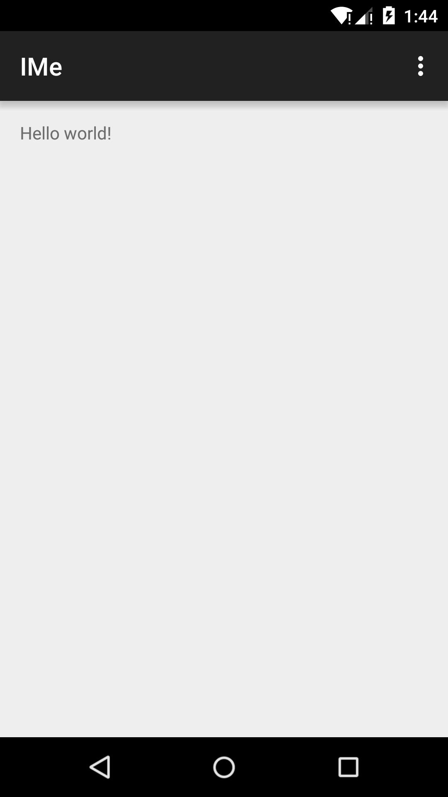

# MeLife
Record the moments of my life, Including other related.

# ScreenShot

# Contact me
zhuyuliang0@126.com

# 后续更新计划
  1.框架和架构搭建完毕
    (1)友盟的添加  统计，分享，更新，意见反馈，推送
    (2)
  2.简单的实现主要的模块
  3.拍照的处理和上传

# 代码引用库
1.	compile 'com.android.support:recyclerview-v7:22.2.0'
2.	compile 'com.android.support:cardview-v7:22.2.0'
3.	compile 'com.android.support:design:22.2.0'
4.  compile 'com.android.support:appcompat-v7:23.0.0'

5.	compile 'com.jakewharton:butterknife:6.1.0'  View注入框架
6.	compile 'com.jenzz:materialpreference:1.3'   Material Design风格的Preference
7.	compile 'com.rengwuxian.materialedittext:library:2.1.4'  EditText的封装
8.	compile 'org.litepal.android:core:1.2.1'     数据库封装工具
9.  compile 'de.greenrobot:eventbus:2.4.0'       一款针对Android优化的发布/订阅事件总线
10. compile 'de.hdodenhof:circleimageview:1.3.0'
11. compile 'com.nostra13.universalimageloader:universal-image-loader:1.9.3'

# LICENSE
   Copyright 2015 Quinn Chen

   Licensed under the Apache License, Version 2.0 (the "License");
   you may not use this file except in compliance with the License.
   You may obtain a copy of the License at

       http://www.apache.org/licenses/LICENSE-2.0

   Unless required by applicable law or agreed to in writing, software
   distributed under the License is distributed on an "AS IS" BASIS,
   WITHOUT WARRANTIES OR CONDITIONS OF ANY KIND, either express or implied.
   See the License for the specific language governing permissions and
   limitations under the License.